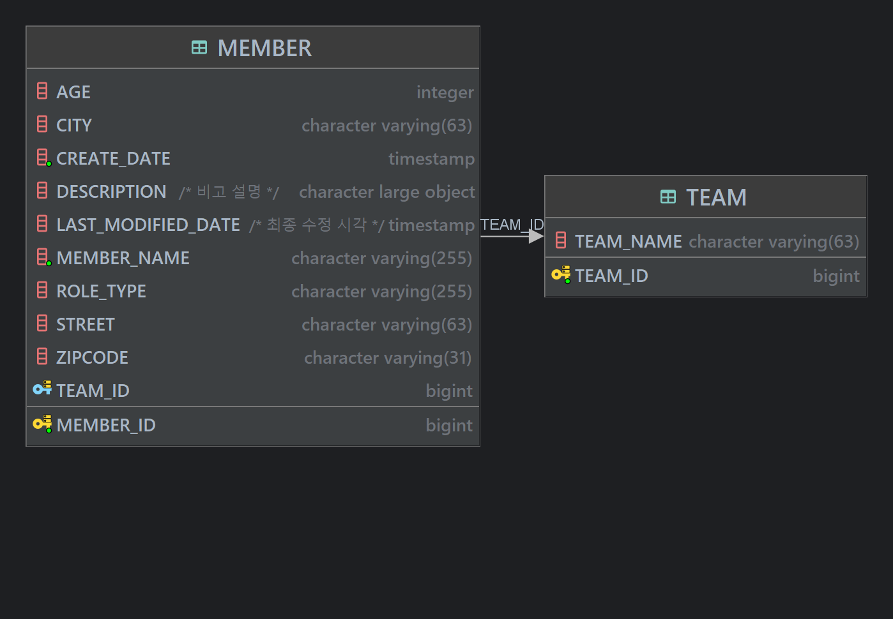
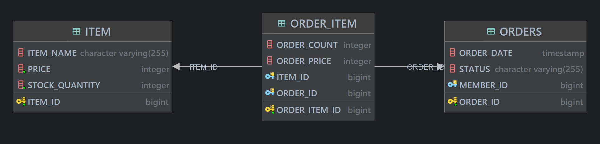

# JPA Practice
Don't need to set up SpringBoot. \
Understand the way of JPA how to operate.

## Hibernate configuration
Hibernate is implementation of JPA interface. 

You need to set up before entering project.

#### src/main/resources/META-INF/persistence.xml
```xml
<property name="hibernate.hbm2ddl.auto" value="validate" />
```

### hbm2dll.value option

| Value       | Description                                                  | When to use                                                |
|-------------|--------------------------------------------------------------|------------------------------------------------------------|
| create      | 시작시 스키마를 재생성                                                 | 개발 초기단계                                                    |
| create-drop | 어플리케이션 종료 시점에 생성했던 스키마 삭제                                    | 테스트 케이스를 실행하고 깔끔하게 모두 삭제하고 싶을 때                            |
| update      | 시작시 Entity class 구성과 스키마를 비교하여 컬럼 추가/삭제 , 기존 스키마를 삭제하지 않고 유지 | 개발 초기단계 또는 테스트 서버에서 변경된 스키마만 ALTER 로 반영하고 싶을 때 (운영에는 사용 X) |
| validate    | 시작시 Entity class 구성과 스키마가 다르다면 예외를 발생시킴.                     | Entity class 정의와 테이블이 정확히 일치하는지만 미리 확인 할 때                 |
| none        | 사용하지 않음                                                      | 관례상 위 옵션을 사용하지 않을 때 명시                                     |  

> 📝 staging 및 production 에는 `validate`, `none` 을 제외하고 절대 쓰지 마라.
> 복구가 불가능하다.
> **그냥 모르겠으면 안전하게 `validate`, `none` 을 써라.**

### DB DDL Tip 
- DDL 은 스크립트를 직접 작성해서 테스트 DB 에 먼저 테스트 한 후 반영하라. \
자동으로 툴이 생성해주는 DDL 에는 위험이 존재한다.
- ALTER, DROP 같은 DDL 은 애초에 개발자가 쓰지 못하게 계정 단위로 잠궈놓는다.
- 최대한 많은 어노테이션을 사용하여 Entity class 내에서 컬럼 정보를 정확히 개발자가 알아볼 수 있게 명시하라. \
그렇지 않으면 직접 DB DDL 을 확인해야해서 번거롭다.

## Entity - Table mapping guide

### Mapping annotations
| Index       | Description                                         |
|-------------|-----------------------------------------------------|
| @Column     | Column                                              |
| @Comment    | Comments on table, column ..                        |
| @Temporal   | Date/Time/Timestamp                                 |
| @Enumerated | enum type                                           |
| @Lob        | BLOB, CLOB                                          |
| Transient   | Not mapping to DB, just use in application instance |

> ✒️ From java 8, Use `LocalDateTime` instead of `@Temporal` \
Is there any timezone issue?

### Column annotations
| Index            | Description                          |
|------------------|--------------------------------------|
| name             | column name                          |
| nullable         | NULL constraint                      |
| unique           | Unique constraint                    |
| columnDefinition | Input column info using sql syntax   |
| length           | Length of varchar, varchar2, etc..   |
| precision scale  | Use in BigDecimal or BigInteger type |

### Primary Key Mapping
Use `@GeneratedValue`

| Generation Strategy | Description                                             |
|---------------------|---------------------------------------------------------|
| Auto                | Chosen automatically according to DBMS                  |
| IDENTITY            | Generated by default as IDENTITY                        |
| SEQUENCE            | Create and use database sequence object and allocate it |
| TABLE               | Use key generator table (Not recommended)               |

### Tips on Primary Key
You need set the PK meets conditions as shown below.
> 1. Use Long type
> 2. Use Candidate key
> 3. Use Key generation 

### Compare IDENTITY vs SEQUENCE strategy
You can choice **SEQUENCE** when you need JDBC batch insert query \
IDENTITY strategy doesn't support batch optimization since it's required insert query executed to DB for getting generated key.

Refer to [this docs](https://docs.jboss.org/hibernate/orm/current/userguide/html_single/Hibernate_User_Guide.html#identifiers-generators)

---

# Relationship



#### Member.java
```java
@Table(name = "member")
@NoArgsConstructor(access = AccessLevel.PROTECTED)
@Getter
public class Member {
    // ..
    @ManyToOne
    @JoinColumn(name = "team_id")
    private Team team;
    // ..
}
```

#### Team.java
```java
@Entity
@Getter
@NoArgsConstructor(access = AccessLevel.PROTECTED)
public class Team {
    // ..
    @Id
    @GeneratedValue(strategy = GenerationType.SEQUENCE)
    @Column(name = "team_id")
    private Long id;
    // ..
}
```

### Entity class
회원 -> 팀 연관관계 1개 \
팀 -> 회원 연관관계 1개 \
그래서 양방향으로 보이지만 사실상 단방향이 2개 \
객체를 양방향으로 참조하려면 단방향 연관관계를 2개 만들어야한다.

### Dilemma
> 둘 중 어느 객체에서 외래키를 관리할지 **하나를 결정**해야함. \
> 이때 선택된 엔티티 객체를 **연관관계 주인**이라 함. \
> **연관관계 주인만이 외래 키를 관리 (등록 & 수정)** \
> **주인이 아닌 쪽은 오로지 조회만 가능.** \
> `@JoinColumn` annotation 을 가진 쪽이 연관관계 주인 

```java
team
    .getMembers()[0]
    .setTeam("~~")
```
**수정 시도는 Team 에서 했지만 , Member 에 영향을 미친다.**

### Table relation
테이블 관점으로 연관관계를 보면 관계를 결정하는 것은 외래키 단 하나다. \
team_id 를 가진 FK 있는거 하나로 테이블 상에서는 모든 것을 알 수 있다.

## 📝 Entity class 설계 팁
### 1.  단방향 연관관계로 엔티티 클래스 설계를 끝내라.
양방향 연관관계는 꼭 필요할 때만 사용해야한다.

### 2. 비즈니스 로직이 아닌 외래키 위치로 연관관계 주인 결정

#### _외래키를 가진 엔티티를 연관관계 주인으로 정해야한다._
1:N 일 때 \
부모 1을 `mappedBy` 를 통해 자식을 맵핑하고 `OneToMany`으로 지정한다.\
자식 N을 연관관계 주인으로 두어 `ManyToOne` 으로 지정한다. \
mappedBy 에 의해 참조되는 변수가 Foreign key 다.


#### _왜 자식을 연관관계 주인으로 두는가?_
부모인 팀의 `members` 를 수정하여 테이블 업데이트를 한다고 가정하면 \
객체 상에서 변화를 가한 쪽은 부모 객체인데 \
자식 객체와 테이블에 Update query 가 실행된다.

### 3. 객체 상에도 모두 연관관계 로직을 적용한 연관관계 편의 메소드 사용
객체상에서도 서로 관계를 맺어줘야 이슈가 발생하지 않는다.
```java
/**
 * 연관관계 편의 메소드
 * @param team
 */
public void changeMemberTeam(Team team) {
    this.team = team;
    team.getMembers().add(this);
}
```

### 4. Lombok 의 toString() 이나 JSON 라이브러리 사용시 무한루프에 빠지지 않도록 유의
해당 라이브러리 로직을 보면 member -> team -> members -> team -> members ... 등 계속 타고 들어갈 위험이 있음.

### 5. Controller 에서 Entity 를 그대로 return 하지 않고 DTO 를 사용하길 권장.
Entity 를 그대로 리턴한다는 것은 Entity 컬럼 변경시 API spec 이 같이 변할 수 있다.

### 6. @ManyToMany 대신 맵핑 테이블을 사용하고 PK는 고유의 값으로만 지정.
item_id 와 order_id 등을 합쳐 복합키를 기본키로 지정할 수도 있으나 \
정합성에만 좋을 뿐 실제 애플리케이션 운영면에서는 스키마 변경이 종속성으로 인해 매우 어려워지기 때문에 \
비즈니스상 의미 없더라도 별도의 order_item_id 를 `auto_increment` 로 걸길 추천한다.



### 7. MappedSuperclass 적극 활용
다음 프로퍼티는 BaseEntity 에 포함시켜 상속받아 쓰는것이 운영 측면에서 좋다.
- createdBy
- createdTimestamp
- lastModifiedBy
- lastModifiedTimestamp

### 8. 상속관계 매핑은 기본적으로 `JOINED` or `SINGLE_TABLE` 전략 사용
JOINED 가 가장 정규화 되어있고 적은 스토리지로 높은 정합성을 보장하나 테이블 갯수와 쿼리 복잡도 증가 \
하루에 데이터가 100만건 이상 쌓이고 누적 레코드가 1억건 이상으로 Partitioning 등 이슈가 많아질 경우엔 \
SINGLE_TABLE 을 사용하여 단순한 테이블 스키마 구조를 택하는 것이 유리할 수 있음. \
**절대적인 정답은 없다.**


