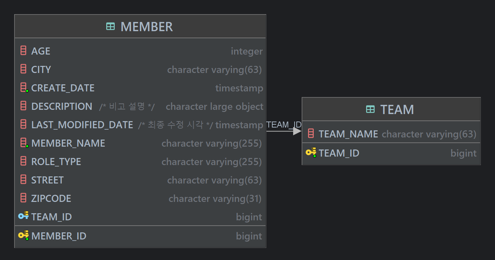
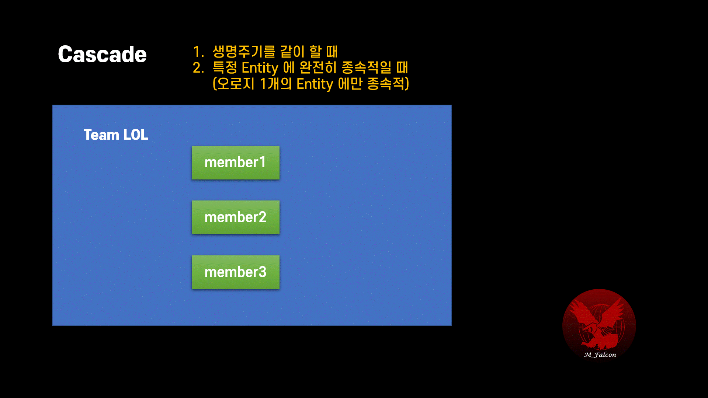

# JPA Practice
Don't need to set up SpringBoot. \
Understand the way of JPA how to operate.

## Hibernate configuration
Hibernate is implementation of JPA interface. 

You need to set up before entering project.

#### src/main/resources/META-INF/persistence.xml
```xml
<property name="hibernate.hbm2ddl.auto" value="validate" />
```

### hbm2dll.value option

| Value       | Description                                                  | When to use                                                |
|-------------|--------------------------------------------------------------|------------------------------------------------------------|
| create      | 시작시 스키마를 재생성                                                 | 개발 초기단계                                                    |
| create-drop | 어플리케이션 종료 시점에 생성했던 스키마 삭제                                    | 테스트 케이스를 실행하고 깔끔하게 모두 삭제하고 싶을 때                            |
| update      | 시작시 Entity class 구성과 스키마를 비교하여 컬럼 추가/삭제 , 기존 스키마를 삭제하지 않고 유지 | 개발 초기단계 또는 테스트 서버에서 변경된 스키마만 ALTER 로 반영하고 싶을 때 (운영에는 사용 X) |
| validate    | 시작시 Entity class 구성과 스키마가 다르다면 예외를 발생시킴.                     | Entity class 정의와 테이블이 정확히 일치하는지만 미리 확인 할 때                 |
| none        | 사용하지 않음                                                      | 관례상 위 옵션을 사용하지 않을 때 명시                                     |  

> 📝 staging 및 production 에는 `validate`, `none` 을 제외하고 절대 쓰지 마라.
> 복구가 불가능하다.
> **그냥 모르겠으면 안전하게 `validate`, `none` 을 써라.**

### DB DDL Tip 
- DDL 은 스크립트를 직접 작성해서 테스트 DB 에 먼저 테스트 한 후 반영하라. \
자동으로 툴이 생성해주는 DDL 에는 위험이 존재한다.
- ALTER, DROP 같은 DDL 은 애초에 개발자가 쓰지 못하게 계정 단위로 잠궈놓는다.
- 최대한 많은 어노테이션을 사용하여 Entity class 내에서 컬럼 정보를 정확히 개발자가 알아볼 수 있게 명시하라. \
그렇지 않으면 직접 DB DDL 을 확인해야해서 번거롭다.

## Entity - Table mapping guide

### Mapping annotations
| Index       | Description                                         |
|-------------|-----------------------------------------------------|
| @Column     | Column                                              |
| @Comment    | Comments on table, column ..                        |
| @Temporal   | Date/Time/Timestamp                                 |
| @Enumerated | enum type                                           |
| @Lob        | BLOB, CLOB                                          |
| Transient   | Not mapping to DB, just use in application instance |

> ✒️ From java 8, Use `LocalDateTime` instead of `@Temporal` \
Is there any timezone issue?

### Column annotations
| Index            | Description                          |
|------------------|--------------------------------------|
| name             | column name                          |
| nullable         | NULL constraint                      |
| unique           | Unique constraint                    |
| columnDefinition | Input column info using sql syntax   |
| length           | Length of varchar, varchar2, etc..   |
| precision scale  | Use in BigDecimal or BigInteger type |

### Primary Key Mapping
Use `@GeneratedValue`

| Generation Strategy | Description                                             |
|---------------------|---------------------------------------------------------|
| Auto                | Chosen automatically according to DBMS                  |
| IDENTITY            | Generated by default as IDENTITY                        |
| SEQUENCE            | Create and use database sequence object and allocate it |
| TABLE               | Use key generator table (Not recommended)               |

### Tips on Primary Key
You need set the PK meets conditions as shown below.
> 1. Use Long type
> 2. Use Candidate key
> 3. Use Key generation 

### Compare IDENTITY vs SEQUENCE strategy
You can choice **SEQUENCE** when you need JDBC batch insert query \
IDENTITY strategy doesn't support batch optimization since it's required insert query executed to DB for getting generated key.

Refer to [this docs](https://docs.jboss.org/hibernate/orm/current/userguide/html_single/Hibernate_User_Guide.html#identifiers-generators)

---

## Spring Data JPA
| JPA            | Hibernate                     | Spring DATA JPA            |
|----------------|-------------------------------|----------------------------|
| Just interface | Impelmentation instanceof JPA | Module for easy to use JPA |

### 1. Setting build.gradle
#### build.gradle
```build.gradle
dependencies {
//..
	implementation 'org.springframework.boot:spring-boot-starter-data-jpa'
}
```
### 2. Create interface inheritance of DataJPA
```java
@Repository
public interface UserRepository extends JpaRepository<User, Long> {
}
```
### 3. Test with DI `@DataJpaTest` annotation
```java
// This annotation includes next 2line (@Transactional, @Rollback)
// This disables full auto-configuration and instead apply only configuration relevant to JPA tests.
@DataJpaTest 
@Transactional // Restrict each test code in transaction
@Rollback(value = true)
class UserRepositoryTest {
    @Autowired
    private UserRepository userRepository;
    // ..
}
```
---

# Relationship



#### Member.java
```java
@Table(name = "member")
@NoArgsConstructor(access = AccessLevel.PROTECTED)
@Getter
public class Member {
    // ..
    @ManyToOne
    @JoinColumn(name = "team_id")
    private Team team;
    // ..
}
```

#### Team.java
```java
@Entity
@Getter
@NoArgsConstructor(access = AccessLevel.PROTECTED)
public class Team {
    // ..
    @Id
    @GeneratedValue(strategy = GenerationType.SEQUENCE)
    @Column(name = "team_id")
    private Long id;
    // ..
}
```

### Entity class
회원 -> 팀 연관관계 1개 \
팀 -> 회원 연관관계 1개 \
그래서 양방향으로 보이지만 사실상 단방향이 2개 \
객체를 양방향으로 참조하려면 단방향 연관관계를 2개 만들어야한다.

### Dilemma
> 둘 중 어느 객체에서 외래키를 관리할지 **하나를 결정**해야함. \
> 이때 선택된 엔티티 객체를 **연관관계 주인**이라 함. \
> **연관관계 주인만이 외래 키를 관리 (등록 & 수정)** \
> **주인이 아닌 쪽은 오로지 조회만 가능.** \
> `@JoinColumn` annotation 을 가진 쪽이 연관관계 주인 

```java
team
    .getMembers()[0]
    .setTeam("~~")
```
**수정 시도는 Team 에서 했지만 , Member 에 영향을 미친다.**

### Table relation
테이블 관점으로 연관관계를 보면 관계를 결정하는 것은 외래키 단 하나다. \
team_id 를 가진 FK 있는거 하나로 테이블 상에서는 모든 것을 알 수 있다.

## 📝 Entity class 설계 팁
### 1.  단방향 연관관계로 엔티티 클래스 설계를 끝내라.
양방향 연관관계는 꼭 필요할 때만 사용해야한다.

### 2. 비즈니스 로직이 아닌 외래키 위치로 연관관계 주인 결정

#### _외래키를 가진 엔티티를 연관관계 주인으로 정해야한다._
1:N 일 때 \
부모 1을 `mappedBy` 를 통해 자식을 맵핑하고 `OneToMany`으로 지정한다.\
자식 N을 연관관계 주인으로 두어 `ManyToOne` 으로 지정한다. \
mappedBy 에 의해 참조되는 변수가 Foreign key 다.


#### _왜 자식을 연관관계 주인으로 두는가?_
부모인 팀의 `members` 를 수정하여 테이블 업데이트를 한다고 가정하면 \
객체 상에서 변화를 가한 쪽은 부모 객체인데 \
자식 객체와 테이블에 Update query 가 실행된다.

### 3. 객체 상에도 모두 연관관계 로직을 적용한 연관관계 편의 메소드 사용
객체상에서도 서로 관계를 맺어줘야 이슈가 발생하지 않는다.
```java
/**
 * 연관관계 편의 메소드
 * @param team
 */
public void changeMemberTeam(Team team) {
    this.team = team;
    team.getMembers().add(this);
}
```

### 4. Lombok 의 toString() 이나 JSON 라이브러리 사용시 무한루프에 빠지지 않도록 유의
해당 라이브러리 로직을 보면 member -> team -> members -> team -> members ... 등 계속 타고 들어갈 위험이 있음.

### 5. Controller 에서 Entity 를 그대로 return 하지 않고 DTO 를 사용하길 권장.
Entity 를 그대로 리턴한다는 것은 Entity 컬럼 변경시 API spec 이 같이 변할 수 있다.

### 6. @ManyToMany 대신 맵핑 테이블을 사용하고 PK는 고유의 값으로만 지정.
item_id 와 order_id 등을 합쳐 복합키를 기본키로 지정할 수도 있으나 \
정합성에만 좋을 뿐 실제 애플리케이션 운영면에서는 스키마 변경이 종속성으로 인해 매우 어려워지기 때문에 \
비즈니스상 의미 없더라도 별도의 order_item_id 를 `auto_increment` 로 걸길 추천한다.


### 7. MappedSuperclass 적극 활용
다음 프로퍼티는 BaseEntity 에 포함시켜 상속받아 쓰는것이 운영 측면에서 좋다.
- createdBy
- createdTimestamp
- lastModifiedBy
- lastModifiedTimestamp

### 8. 상속관계 매핑은 기본적으로 `JOINED` or `SINGLE_TABLE` 전략 사용
JOINED 가 가장 정규화 되어있고 적은 스토리지로 높은 정합성을 보장하나 테이블 갯수와 쿼리 복잡도 증가 \
하루에 데이터가 100만건 이상 쌓이고 누적 레코드가 1억건 이상으로 Partitioning 등 이슈가 많아질 경우엔 \
SINGLE_TABLE 을 사용하여 단순한 테이블 스키마 구조를 택하는 것이 유리할 수 있음. \
**절대적인 정답은 없다.**

### 9. 엔티티가 특정 엔티티에만 종속적이고 완전히 생명주기를 같이할 때 `CASCADE` 옵션 사용
CASCADE 는 부모 엔티티의 영속성 상태를 자식 엔티티에 전이시킨다.


### 9-1. 고아 객체 (부모 엔티티)를 부모와 함께 삭제처리 하고싶다면 `orphanRemoval` 옵션을 부모쪽에 사용
`CASCADE`와 `orphanRemoval` 옵션을 동시에 사용하면 완전히 생명주기를 같이하는 로직을 구성할 수 있다.
테이블 관점에서 보면 `orphanRomoval` 은 자식 테이블의 FK가 NULL 상태가 되는 시점에 삭제를 강제하는 (ON DELETE 와 유사) 액션 여부이다.

#### Team.java
```java
public class Team extends BaseEntity {
    // 
    @OneToMany(mappedBy = "team", cascade = CascadeType.ALL, orphanRemoval = true)
    private List<Member> members = new ArrayList<>();
}
```

| 행위와 옵션         | CASCADE.REMOVAL    | orphanRemoval = true |
|----------------|--------------------|----------------------|
| 부모 엔티티 삭제      | 자식 엔티티 삭제 (영속성 전이) | 자식 엔티티 삭제 (고아 상태가 됨) |
| 부모에서 자식 엔티티 삭제 | 단독으로는 자식 엔티티 삭제 X  | 단독으로 자식 엔티티 삭제 O     |


### 10. 임베디드 타입을 적극 활용하라.
잘 설계한 Entity 는 테이블 보다 갯수가 많고 추가 테이블을 생성 없이 객체와 테이블 매핑을 세밀하게 할 수 있다. \
임베디드 타입에 메소드를 정의할 수 있고 엔티티에 생명주기가 의존적이라 객체 지향적 코드 작성이 용이하다.

### 11. 임베디드 타입은 무조건 불변객체로 만들어라.

- 오로지 생성자로 해당 객체를 새로 할당하는 방식(Immutable)을 택하도록 강제하라. \ 
공유 객체 참조를 막을 방법이 없기 때문에. 공유 객체 참조 상황시 디버깅은 정말 어렵다.
- 값 타입 (임베디드 타입)은 식별자가 존재하지 않아도 되는, 단순한 디자인이 가능한 경우에 사용한다.

> 식별자가 필요하거나 지속해서 값을 추적, 변경해야 한다면 여지없이 엔티티로 승격시켜라.

### 12. 값 타입 컬렉션은 별도의 테이블을 구성해야한다.
**DB 모델링 측면에선 극히 상식적인 이야기다.** \
한 테이블 내에 복수 값을 갖는 컬럼을 구성하는 것은 좋은 설계가 아니다.

**아예 1:N 단방향 관계 또는 양방향 관계로 분리하고 별도 테이블을 만드는 것이 좋다.** \
이는 일종의 정규화로 특정 엔티티에 같은 맥락을 가지는 컬럼이 다수가 될 때 정규화를 통해 별도의 테이블(엔티티)를 구성하는 것과 같다. \
이렇게 만들어진 엔티티를 `Cascade`, `orphanRemoval` 로 라이프 사이클을 부모에 종속시키는 것이 애플리케이션 사이드 이펙트도 없애고, DB 모델링 측면에서도 깔끔한 설계다.

> `ElementCollection`, `CollectionTable` 어노테이션으로 설정하는 방법이 존재하지만 \
> 해당 Embeddable 타입이 가진 모든 컬럼을 묶어 PK 로 생성해야한다. \
> 그러나 JPA 는 아예 PK 가 없는 테이블을 생성해버린다. \
> 이렇게되면, 해당 Entity class 에서 값 타입 컬렉션에 업데이트를 시도할 때 \  
> 모든 컬렉션을 싹다 지우고 변경된 상태를 통째로 저장하게된다.

```java
@Entity
public class Member{
    // ..
    @ElementCollection(fetch = LAZY)
    // 별도로 food_table 이 생성됨.
    // FK 를 갖는 자식 테이블로 생성됨.
    @CollectionTable(
            name = "favorite_food",
            joinColumns = @JoinColumn(name = "member_id")
    )
    @Column(name = "food_name", length = 63)
    private Set<String> favoriteFoods = new HashSet<String>();
}
```
```sql
-- @ElementCollection 과 CollectionTable 을 통해 만들어진 값타입 테이블, PK 가 존재하지 않는다.
create table FAVORITE_FOOD
(
    MEMBER_ID BIGINT not null,
    FOOD_NAME CHARACTER VARYING(255),
    -- PK가 필요한데, 여기서 PK 를 만드는 방법은 모든 컬럼을 함께 복합키로 만드는 법 뿐.
    -- 그럴바엔 별도의 테이블을 생성하는게 낫다.
    constraint FKNJ8USKU5AYU0PGLSUHQOIJHRM
        foreign key (MEMBER_ID) references MEMBER
);
```
